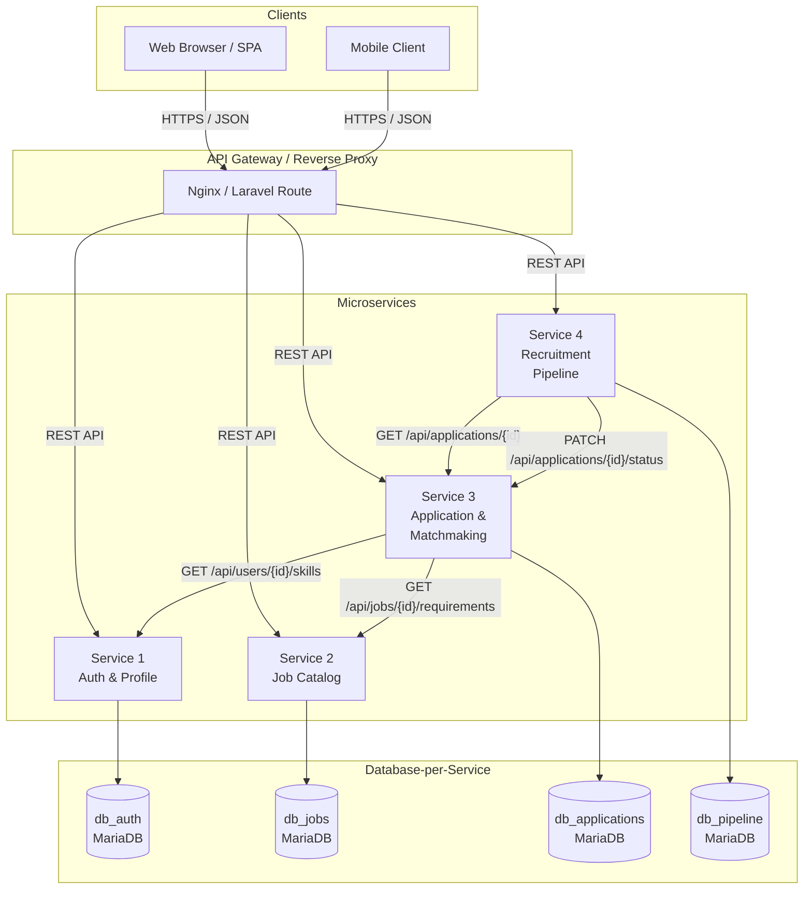
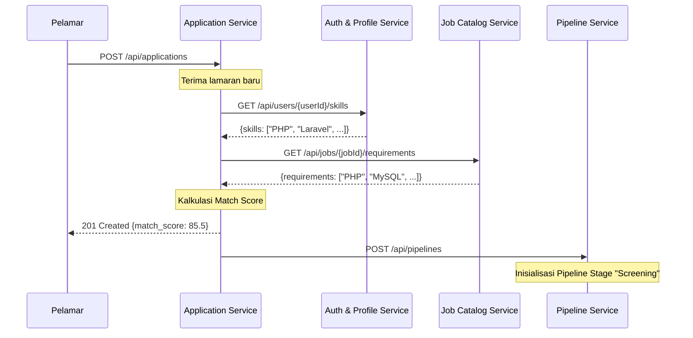
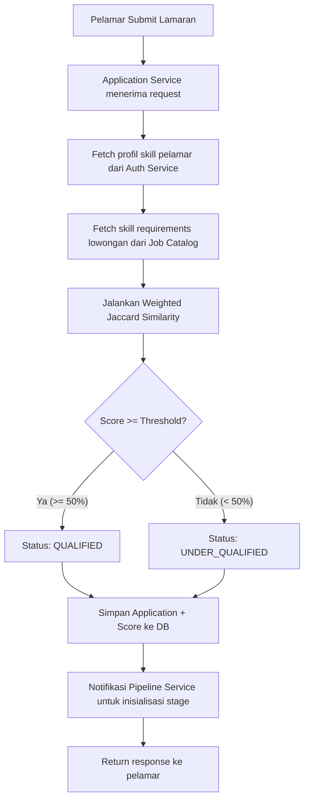
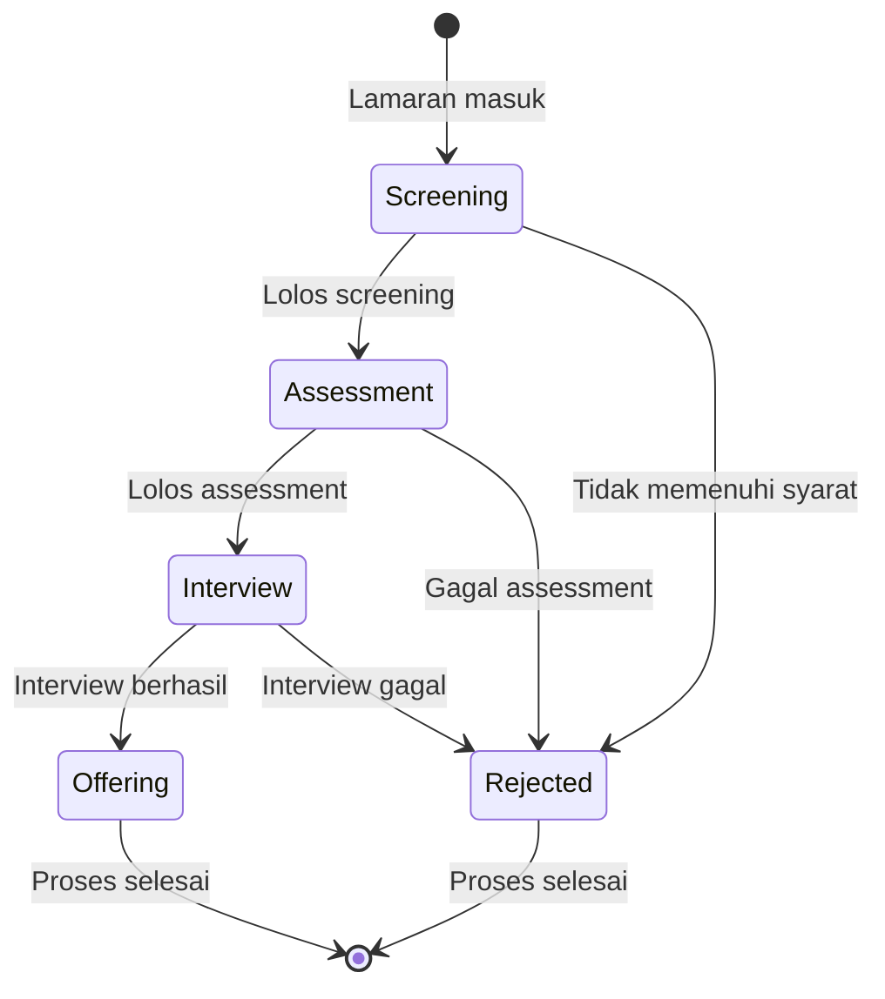
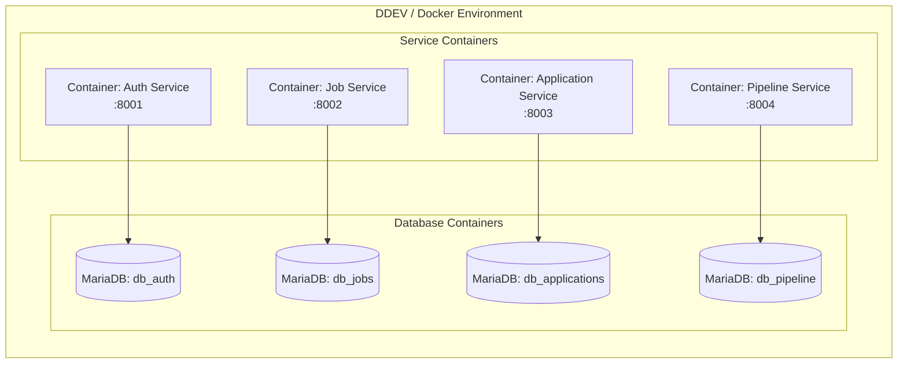

# Arsitektur Sistem PaduKerja

> Platform Rekrutmen Terintegrasi Berbasis Microservice dengan Mesin Pemadanan Keahlian Otomatis

---

## 1. Diagram Topologi Konteks Sistem



---

## 2. Komunikasi Inter-Service

### 2.1 Pola Database-per-Service

Setiap microservice memiliki database sendiri yang **terisolasi penuh**. Tidak ada service yang boleh mengakses database service lain secara langsung.

| Service | Database | Tabel Utama |
|---------|----------|-------------|
| Auth & Profile | `db_auth` | `users`, `user_skills`, `roles` |
| Job Catalog | `db_jobs` | `jobs`, `job_requirements`, `skill_tags` |
| Application & Matchmaking | `db_applications` | `applications`, `match_scores`, `cv_documents` |
| Recruitment Pipeline | `db_pipeline` | `pipeline_stages`, `stage_transitions`, `interview_schedules` |

### 2.2 Komunikasi via REST API

Komunikasi antar service dilakukan melalui **HTTP REST API** dengan kontrak JSON yang ketat:



### 2.3 Aturan Komunikasi

1. **Synchronous REST** - Semua komunikasi inter-service menggunakan HTTP request synchronous.
2. **Service Discovery** - Base URL tiap service dikonfigurasi via environment variable (`.env`).
3. **Timeout & Retry** - Setiap request inter-service memiliki timeout 5 detik dengan maksimum 2 retry.
4. **Circuit Breaker** - Jika service target gagal >3 kali berturut-turut, request dihentikan sementara selama 30 detik.
5. **Idempotency** - Operasi `PUT` dan `DELETE` harus idempotent.

---

## 3. Automated Skill-Matchmaking Engine

### 3.1 Konsep

Matchmaking engine menghitung persentase kecocokan antara **skill profile pelamar** dengan **skill requirements lowongan**. Kalkulasi dilakukan secara real-time saat pelamar mengajukan lamaran.

### 3.2 Formula Pencocokan

#### Weighted Jaccard Similarity

Setiap skill memiliki **bobot (weight)** yang ditetapkan oleh recruiter pada lowongan:

```
Match Score = (Σ weight_i untuk skill yang cocok) / (Σ weight_i untuk semua required skill) × 100%
```

**Contoh Kalkulasi:**

| Required Skill | Weight | Dimiliki Pelamar? | Kontribusi |
|----------------|--------|-------------------|------------|
| PHP | 3 (Required) | ✅ Ya | 3 |
| Laravel | 3 (Required) | ✅ Ya | 3 |
| MySQL | 2 (Important) | ✅ Ya | 2 |
| Redis | 1 (Nice-to-have) | ❌ Tidak | 0 |
| Docker | 1 (Nice-to-have) | ❌ Tidak | 0 |

```
Match Score = (3 + 3 + 2) / (3 + 3 + 2 + 1 + 1) × 100% = 8/10 × 100% = 80%
```

### 3.3 Kategori Weight

| Level | Weight | Deskripsi |
|-------|--------|-----------|
| Required | 3 | Wajib dimiliki, tanpa ini pelamar sangat kurang qualified |
| Important | 2 | Penting, memberikan kontribusi signifikan |
| Nice-to-have | 1 | Nilai tambah, tidak wajib |

### 3.4 Alur Proses



### 3.5 Threshold Score

| Range | Kategori | Aksi Default |
|-------|----------|--------------|
| 80-100% | Excellent Match | Auto-proceed ke Assessment |
| 50-79% | Good Match | Masuk Screening untuk review manual |
| 0-49% | Under Qualified | Ditandai, tetap disimpan untuk pertimbangan |

---

## 4. Struktur Data Utama

### 4.1 Service 1: Auth & Profile - `User`

```json
{
  "id": 1,
  "name": "Budi Santoso",
  "email": "budi@example.com",
  "role": "applicant",
  "profile": {
    "phone": "081234567890",
    "bio": "Backend developer with 3 years experience",
    "location": "Jakarta"
  },
  "skills": [
    { "id": 1, "name": "PHP", "level": "advanced", "years_exp": 3 },
    { "id": 2, "name": "Laravel", "level": "advanced", "years_exp": 2 },
    { "id": 3, "name": "MySQL", "level": "intermediate", "years_exp": 3 }
  ],
  "created_at": "2026-09-01T10:00:00+07:00",
  "updated_at": "2026-09-15T14:30:00+07:00"
}
```

### 4.2 Service 2: Job Catalog - `Job`

```json
{
  "id": 1,
  "title": "Backend Developer",
  "company": "PT Teknologi Maju",
  "description": "Membangun REST API microservices",
  "location": "Jakarta",
  "employment_type": "full-time",
  "salary_range": {
    "min": 8000000,
    "max": 15000000,
    "currency": "IDR"
  },
  "quota": 3,
  "filled": 1,
  "requirements": [
    { "skill": "PHP", "weight": 3, "level": "required" },
    { "skill": "Laravel", "weight": 3, "level": "required" },
    { "skill": "MySQL", "weight": 2, "level": "important" },
    { "skill": "Redis", "weight": 1, "level": "nice_to_have" },
    { "skill": "Docker", "weight": 1, "level": "nice_to_have" }
  ],
  "status": "open",
  "posted_by": 10,
  "created_at": "2026-09-10T09:00:00+07:00",
  "expires_at": "2026-11-10T23:59:59+07:00"
}
```

### 4.3 Service 3: Application & Matchmaking - `Application`

```json
{
  "id": 1,
  "user_id": 1,
  "job_id": 1,
  "cv_file_path": "/storage/cv/2026/budi_santoso_cv.pdf",
  "cover_letter": "Saya tertarik dengan posisi ini...",
  "match_score": 80.0,
  "match_category": "excellent",
  "matched_skills": ["PHP", "Laravel", "MySQL"],
  "missing_skills": ["Redis", "Docker"],
  "status": "submitted",
  "applied_at": "2026-10-01T14:00:00+07:00",
  "updated_at": "2026-10-01T14:00:05+07:00"
}
```

### 4.4 Service 4: Recruitment Pipeline - `PipelineTimeline`

```json
{
  "id": 1,
  "application_id": 1,
  "current_stage": "interview",
  "stages": [
    {
      "stage": "screening",
      "status": "passed",
      "entered_at": "2026-10-01T14:00:05+07:00",
      "completed_at": "2026-10-03T10:00:00+07:00",
      "notes": "Score 80%, auto-qualified"
    },
    {
      "stage": "assessment",
      "status": "passed",
      "entered_at": "2026-10-03T10:00:00+07:00",
      "completed_at": "2026-10-07T16:00:00+07:00",
      "notes": "Technical test completed, score 85/100"
    },
    {
      "stage": "interview",
      "status": "in_progress",
      "entered_at": "2026-10-07T16:00:00+07:00",
      "completed_at": null,
      "interview_schedule": {
        "datetime": "2026-10-10T10:00:00+07:00",
        "type": "online",
        "meeting_url": "https://meet.example.com/interview-123",
        "interviewer": "HR Manager"
      },
      "notes": null
    }
  ],
  "timeline_summary": {
    "total_days": 9,
    "stages_completed": 2,
    "stages_total": 4
  },
  "created_at": "2026-10-01T14:00:05+07:00",
  "updated_at": "2026-10-07T16:00:00+07:00"
}
```

---

## 5. Diagram Alur Pipeline Rekrutmen



---

## 6. Deployment Topology (Development)



---

<p align="center">
  <strong>PaduKerja</strong> · Architecture Documentation · Kelompok 4 UHN
</p>
